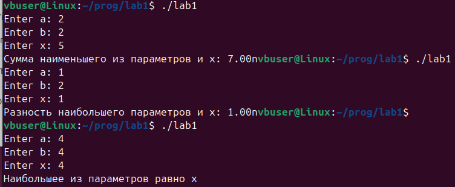

# Отчет
## Задание
1. Разберите код программы из примера.
2. Составьте блок-схему алгоритма для своего варианта.
3. Напишите программу, решающую задачу по своему варианту.
4. Оформите отчёт в README.md:
    - Задание
    - Описание проделанной работы
    - Скриншоты результатов
    - Блок-схему
    - Ссылки на используемые материалы
### Задача
В зависимости от того, что больше, вывести разность наибольшего из параметров ``a``, ``b`` и параметра ``x``, либо сумму наименьшего из параметров и параметра ``x``. В случае равенства вывести соответствующее сообщение.
## Описание проделанной работы
1. Разобран код программы из примера
2. Составлена блок-схема по своему варианту
3. Основываясь на блок-схему и на код из примера, написана программа по своему варианту
4. Оформлен отчет в README.md и отправлено в свой репозиторий на ``GitHub``
## Код
```C
#include <stdio.h>

int main()
{
    float a, b, x;

    printf("Enter a: ");
    scanf("%f", &a);
    printf("Enter b: ");
    scanf("%f", &b);
    printf("Enter x: ");
    scanf("%f", &x);

    float max = (a>b)?a:b;
    float min = (a<b)?a:b;

    if (max>x) {
        printf("Разность наибольшего параметров и х: %.2fn", max-x);
    } else if (max<x) {
        printf("Сумма наименьшего из параметров и х: %.2fn", min+x);
    } else {
        printf("Наибольшее из параметров равно х\n");
    }
    return 0;
}
```
## Скриншоты результатов

## Блок-схема

## Ссылки на используемые ресурсы
- [Разветвляющиеся алгоритмы. Оператор If](https://informatics.msk.ru/mod/book/view.php?id=533)
- [Ветвящиеся алгоритмы](https://studfile.net/preview/8896420/page:4/)
- [Разветвляющиеся алгоритмы](https://acmp.ru/article.asp?id_text=516)
- [Сайт с лабораторной №1](https://evil-teacher.on.fleek.co/prog_pm/term1/lab01/)